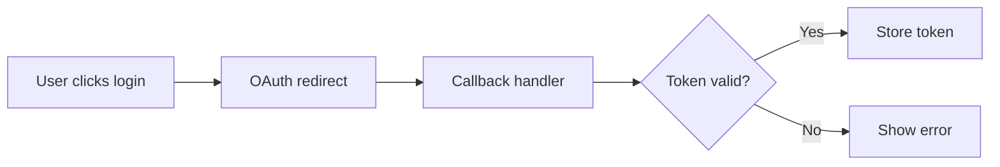

# PR Summary Command

When the user asks to summarize a PR (e.g. "summarize PR", "summarize this PR", "give me a PR summary"), follow these steps:

## Steps

1. Run `git log main...HEAD --oneline` (or `master` if `main` doesn't exist) to list commits on the current branch.
2. Run `git diff main...HEAD --stat` to get a high-level overview of changed files.
3. Run `git diff main...HEAD` to read the full diff (or scope to key files if the diff is very large).
4. If a GitHub PR already exists, run `gh pr view` to get the PR title, description, and metadata.

## Output Format

Produce a summary in this structure:

```
## PR Summary: <branch name or PR title>

### What changed
- <bullet: high-level description of each logical change>

### Why (motivation)
- <bullet: inferred or stated reason for the change>

### Logic Diagram
<Mermaid diagram illustrating the key logic change. Choose the most appropriate diagram type:>
- Use `flowchart LR` for control flow or request/response flows
- Use `sequenceDiagram` for multi-actor interactions (e.g. frontend → backend → API)
- Use `stateDiagram-v2` for state machine changes
- Use `classDiagram` for data model / struct changes
- Only include the changed or new logic — not the entire system
- Keep it focused: 5–10 nodes max

Example (flowchart):


### Files changed
- <file>: <one-line description of what changed>

### Testing
- <how to verify the changes, if inferable>

### Notes / Risks
- <any caveats, breaking changes, or follow-ups>
```

## Post-Summary: Auto-comment on GitHub PR

After producing the summary, automatically post it as a comment on the current GitHub PR:

1. Check if a PR exists for the current branch by running `gh pr view --json number,url` — if no PR exists, skip this step and inform the user.
2. Post the summary as a PR comment using:
   ```
   gh pr comment <PR number> --body "<summary>"
   ```
   Use a heredoc or temp file to safely pass multi-line content:
   ```bash
   gh pr comment <PR number> --body "$(cat <<'EOF'
   <summary content here>
   EOF
   )"
   ```
3. After posting, output the PR comment URL so the user can verify it.

## Guidelines

- Keep each bullet concise (one sentence max).
- Group related file changes together rather than listing every file individually.
- If the diff is large, focus on the most impactful changes.
- Infer motivation from commit messages, code context, and file names — don't fabricate.
- Omit sections that have nothing meaningful to say (e.g. no risks → skip Notes).
- Always include a Logic Diagram — even for small changes, a minimal diagram helps visualize intent.
- Always post the summary as a GitHub PR comment after generating it (see Post-Summary section above).
